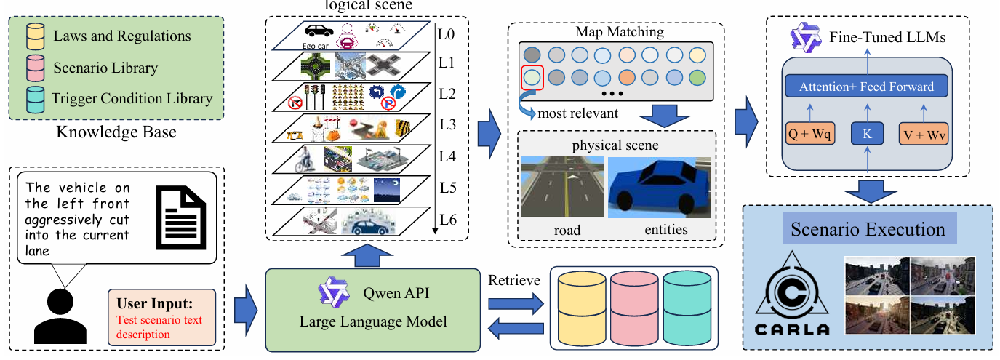
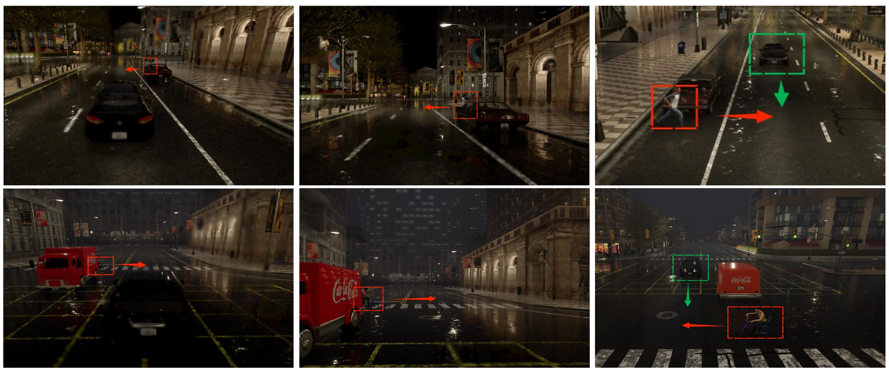

# TextScene

Knowledge-Enhanced Scenario Generation for Autonomous Driving via Map-Topology Abstraction and Heterogeneous Retrieval

[](./TextScene-PartC.pdf)
[](https://www.asam.net/standards/detail/openscenario/)
[](https://carla.org/)

TextScene is a knowledge-enhanced text-to-scenario framework for autonomous driving simulation. It transforms natural-language test requirements into executable OpenSCENARIO files by combining heterogeneous scenario retrieval, semantic map-topology abstraction, physical-parameter grounding, and syntax-constrained code generation.

The framework is designed to reduce three common failure modes in LLM-based scenario generation:

- Logical hallucination caused by missing traffic-risk semantics.
- Spatial invalidity caused by limited understanding of OpenDRIVE map geometry.
- Non-executable OpenSCENARIO code caused by strict XML and simulator constraints.

## Paper

The project paper is included in this repository:

- [TextScene: Knowledge-Enhanced Scenario Generation for Autonomous Driving via Map-Topology Abstraction and Heterogeneous Retrieval](./TextScene-PartC.pdf)

## Framework Architecture



## CARLA Demos

### CARLA Simulation Scenes



The demo videos are stored in this repository under [`demo/`](./demo). GitHub's file-preview page may fail to load MP4 files, so use the direct playback/download links below instead of opening the repository file page.

### Demo 1

<video src="https://raw.githubusercontent.com/JYH527/TextScene/main/demo/textscene_carla_demo_1.mp4" controls width="100%"></video>

[Open Demo 1](https://raw.githubusercontent.com/JYH527/TextScene/main/demo/textscene_carla_demo_1.mp4)

### Demo 2

<video src="https://raw.githubusercontent.com/JYH527/TextScene/main/demo/textscene_carla_demo_2.mp4" controls width="100%"></video>

[Open Demo 2](https://raw.githubusercontent.com/JYH527/TextScene/main/demo/textscene_carla_demo_2.mp4)

## Highlights

- Natural-language scenario generation for autonomous-driving test functions such as AEB and ACC.
- Dual-stream retrieval from scenario libraries and trigger-condition libraries.
- SOTIF-inspired L0-L6 hierarchical scenario representation.
- Map-topology abstraction over OpenDRIVE and CARLA map annotations.
- Physical scenario grounding with road IDs, lane IDs, positions, weather, actors, and actions.
- OpenSCENARIO 1.0 XML generation for esmini and CARLA-oriented simulation workflows.
- Web-based scenario management interface with library search, manual import, scenario generation, conversion, and simulation controls.

## Method Overview

TextScene follows a progressive generation pipeline:

1. User requirements are parsed into logical scenario descriptions.
2. Scenario and trigger knowledge are retrieved from heterogeneous libraries.
3. A semantic map-topology abstraction selects and grounds the road structure.
4. Logical scenarios are instantiated into physical scenarios with executable parameters.
5. A syntax-constrained generation module produces OpenSCENARIO code.
6. The generated scenario can be validated or simulated through esmini and CARLA workflows.

```text
Natural language requirement
        |
        v
Dual-stream retrieval over scenario and trigger libraries
        |
        v
Logical scenario generation with L0-L6 structure
        |
        v
Map-topology matching and physical grounding
        |
        v
OpenSCENARIO generation
        |
        v
esmini / CARLA simulation
```

## Repository Structure

```text
.
|-- backend/
|   |-- app.py                           # Flask API and web frontend server
|   |-- logical_scenario_generator.py    # Logical scenario generation and retrieval
|   |-- physical_scenario_generator.py   # Physical parameter grounding
|   |-- openscenario_code_generator.py   # OpenSCENARIO XML generation
|   |-- esmini_to_carla.py               # esmini-to-CARLA scenario conversion
|   |-- build_all_indices.py             # FAISS index builder
|   |-- maps/                            # OpenDRIVE maps and scenario files
|   |-- faiss_indices/                   # Vector indexes for retrieval
|   `-- scenario_runner/                 # CARLA ScenarioRunner resources
|-- public/
|   |-- index.html                       # Web UI
|   |-- scenarios.json                   # CIDAS scenario library
|   |-- triggers.json                    # Trigger-condition library
|   |-- all_Town_maps.json               # CARLA map semantic annotations
|   `-- map_semantics.json               # Map semantic data
|-- carla/                               # Generated CARLA-oriented XOSC/XODR examples
|-- demo/                                # CARLA demonstration videos
|-- esmini-demo/                         # Bundled esmini demo runtime
|-- simulations/                         # Generated simulation outputs
|-- TextScene-PartC.pdf                  # Project paper
|-- images/                              # Framework architecture and CARLA simulation scenes
`-- README.md
```

## Requirements

- Python 3.9+
- CARLA and ScenarioRunner for CARLA execution
- esmini for OpenSCENARIO preview and validation
- A local or remote OpenAI-compatible LLM endpoint
- A local embedding model for FAISS retrieval, expected at `./bge-m3` by default

Main Python packages used by the backend include:

- `flask`
- `flask-cors`
- `langchain`
- `langchain-openai`
- `langchain-community`
- `langgraph`
- `pydantic`
- `faiss-cpu`
- `sentence-transformers`

## Quick Start

Install Python dependencies:

```bash
pip install flask flask-cors langchain langchain-openai langchain-community langgraph pydantic faiss-cpu sentence-transformers
```

Configure the model endpoint. The backend supports an OpenAI-compatible API through environment variables:

```bash
export VLLM_BASE_URL="http://localhost:8000/v1"
export VLLM_MODEL_NAME_CODE_GEN="your-model-name"
export VLLM_API_KEY="EMPTY"
```

On Windows PowerShell:

```powershell
$env:VLLM_BASE_URL="http://localhost:8000/v1"
$env:VLLM_MODEL_NAME_CODE_GEN="your-model-name"
$env:VLLM_API_KEY="EMPTY"
```

Build or refresh retrieval indexes:

```bash
python backend/build_all_indices.py
```

Start the web application:

```bash
python backend/app.py
```

Then open:

```text
http://127.0.0.1:5000
```

## Generated Outputs

Typical generated artifacts include:

- Structured logical scenarios in JSON.
- Grounded physical scenarios with concrete map and actor parameters.
- OpenSCENARIO `.xosc` files.
- OpenDRIVE `.xodr` map files when needed.
- Simulation packages and execution logs.

## Citation

If you use this repository, please cite the project paper:

```bibtex
@article{textscene2026,
  title   = {TextScene: Knowledge-Enhanced Scenario Generation for Autonomous Driving via Map-Topology Abstraction and Heterogeneous Retrieval},
  author  = {Wang, Ke and Jiang, Yuhao and Qiu, Chuang and Chen, Yang and Chen, Kai},
  year    = {2026}
}
```

## License

Please check the licenses of the included third-party simulators, models, and datasets before redistribution. The bundled esmini and CARLA ScenarioRunner resources may have their own license terms.
